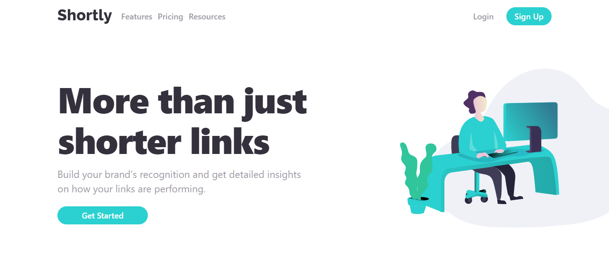

****# Frontend Mentor - Shortly URL shortening API Challenge solution

This is a solution to the [Shortly URL shortening API Challenge challenge on Frontend Mentor](https://www.frontendmentor.io/challenges/url-shortening-api-landing-page-2ce3ob-G). Frontend Mentor challenges help you improve your coding skills by building realistic projects. 

## Table of contents

- [Table of contents](#table-of-contents)
- [Overview](#overview)
  - [The challenge](#the-challenge)
  - [Screenshot](#screenshot)
  - [Links](#links)
- [My process](#my-process)
  - [Built with](#built-with)
  - [What I learned](#what-i-learned)
  - [Continued development](#continued-development)
- [Author](#author)

**Note: Delete this note and update the table of contents based on what sections you keep.**

## Overview

### The challenge

Users should be able to:

- View the optimal layout for the site depending on their device's screen size
- Shorten any valid URL
- See a list of their shortened links, even after refreshing the browser
- Copy the shortened link to their clipboard in a single click
- Receive an error message when the `form` is submitted if:
  - The `input` field is empty

### Screenshot



### Links

- Solution URL: [Add solution URL here](https://your-solution-url.com)
- Live Site URL: [Add live site URL here](https://your-live-site-url.com)

## My process

### Built with

- Tailwind CSS
- Daisy UI
- CSS Grid
- Mobile-first workflow
- axios for data fetching 
- [React](https://reactjs.org/) - JS library

**Note: These are just examples. Delete this note and replace the list above with your own choices**

### What I learned
I learnt how to work with pasting to clipboard using the navigator API. I also learnt how to work with custom hooks.

```js
const useCopyToClipboard = () => {
  const [isCopied, setIsCopied] = useState(false);

  const copyToClipboard = async (content: string) => {
    try {
      await navigator.clipboard.writeText(content);
      setIsCopied(true);
      console.log("Copied to clipboard:", content);
    } catch (error) {
      setIsCopied(false);
      console.error("Unable to copy to clipboard:", error);
    }
  };

  return { isCopied, setIsCopied, copyToClipboard };
};
```

### Continued development
In the future, I would like to add the local storage api to persist user sessions. 
Some animations would be nice as well.


## Author

- website - [Hamdeen](https://my-portfolio-site-gamma-five.vercel.app/)
- Frontend Mentor - [@HamDean](https://www.frontendmentor.io/profile/HamDean)
- Twitter - [@hamdeen247](https://www.twitter.com/hamdeen247)
- github - [Nurudeen Hamzah](https://github.com/HamDean)
